# Architecture

A 10,000-foot view of Livepeer Protocol Explorer. This document summarizes the design, implementation, and data flow of the entire workspace.

> **This is the summary, not the canonical reference.** The authoritative description lives in [docs/product-specs/v1-livepeer-indexer.md](product-specs/v1-livepeer-indexer.md). For per-decision design records see [docs/design-docs/](design-docs/index.md). For runtime operations see [docs/RUNBOOK.md](RUNBOOK.md).

---

## System overview

Livepeer Protocol Explorer ingests every Livepeer protocol log on Arbitrum One into a Postgres database, prices every monetary event at its own block via on-chain oracles, exposes the result over a versioned HTTP API, and serves a static SPA from the same Axum process.

It exists because the Livepeer protocol emits a great deal of monetary activity (bonds, unbonds, rewards, ticket redemptions, gateway deposits) but none of those logs carry a USD amount. Valuing them after the fact through a third-party REST API at query time produces non-reproducible numbers — the same query at a different time returns a different answer.

The system solves this by making one load-bearing guarantee: **byte-deterministic replay**. Given the same RPC cache and SQLite seed, the entire pipeline produces a bit-identical output database. Three subsidiary invariants make that possible:

- **Raw events are immutable.** Once `raw_protocol_events` has a row, only a reorg-driven `block_number`/`block_hash` swap can mutate it (and that mutation is fully audited).
- **Valuations are immutable and versioned.** New pricing logic = new `valuation_version`; existing rows are never edited.
- **No external pricing APIs in the primary path.** Only on-chain Uniswap V3 TWAP × Chainlink ETH/USD plus the trusted SQLite seed.

Two execution modes share the same pipeline:

- **Live mode** — `livepeer-daemon` supervises a long-running loop that pulls logs every 12 s, advances finality every 60 s, prices new events every 60 s, refreshes derived state every 5 min, refreshes matviews every 30 s.
- **Replay mode** — `livepeer-orchestrator replay` runs the same pipeline non-interactively against a fixture (RPC cache + seed) and is the basis for the CI determinism gate.

---

## Component diagram

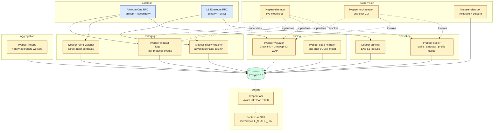

Everything inside the dashed boundary is shipped as a single Docker image (12 binaries built from one workspace). The daemon and orchestrator don't duplicate worker logic — they invoke the same library code that the standalone binaries do.

---

## End-to-end data flow

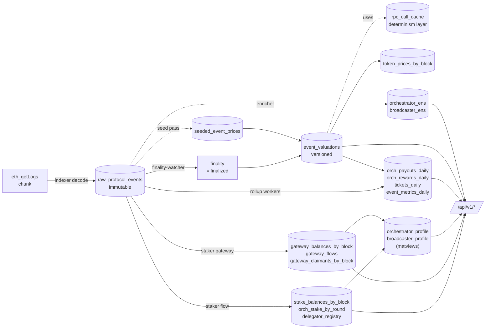

Read top-to-bottom, left-to-right: chain logs arrive, get decoded and persisted, march to finality, get priced, get aggregated, get served. Every solid arrow is a write; dashed arrows are reads / one-shot bootstraps. The `rpc_call_cache` is the sole source of replay determinism — every off-chain read by `livepeer-valuator` is mediated by it.

---

## Key sequences

### Live-mode tick

The daemon supervisor interleaves tasks on independent cadences. A typical 5-minute window looks like this:

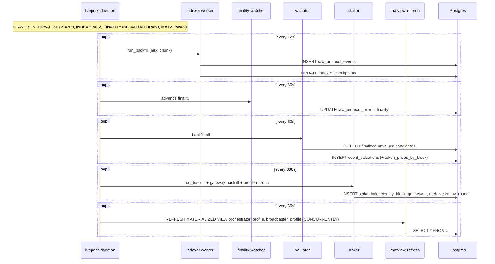

In practice the standalone follow-mode binaries (rollups, profile-follow, tx-receipts-follow, the gateway loop wrapper) run alongside the daemon — they have their own cadence loops for the same reason. The split mirrors SPEC §15.2.

### Single-event pricing

This is the determinism story in concrete form. Every off-chain read passes through `rpc_call_cache`:

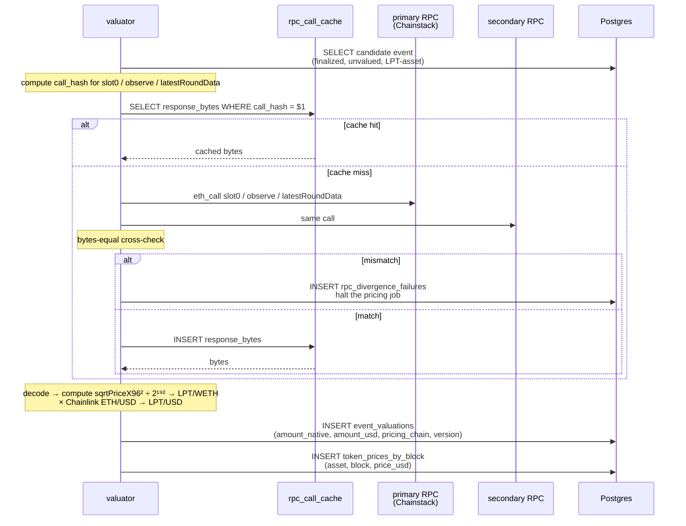

The bytes-equal cross-check (primary vs secondary) is what catches RPC tampering or single-provider drift. The `rpc_call_cache` row is what enables a second run on a wiped DB to produce identical valuations.

### API request

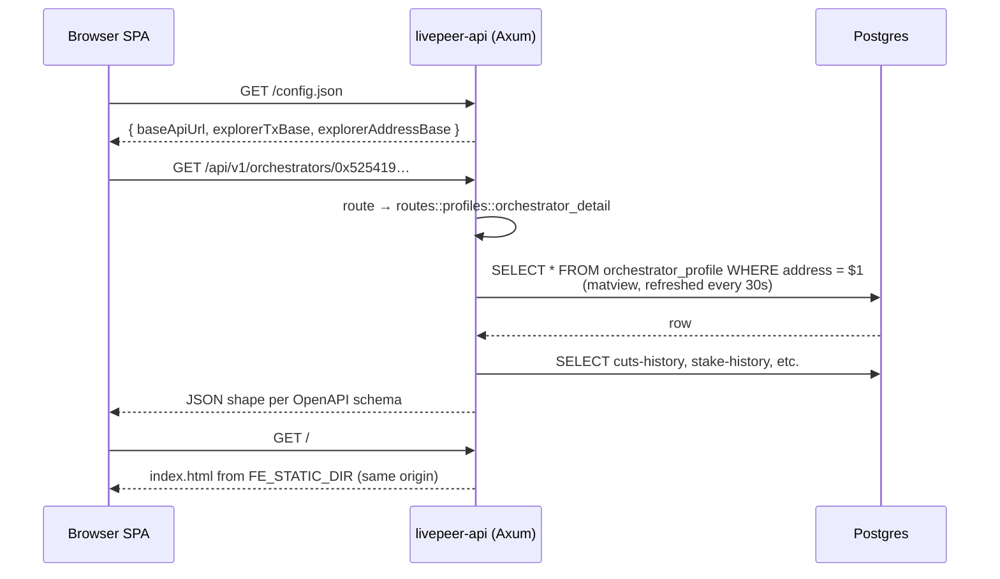

Business endpoints are prefixed with `/api/v1/`; operational endpoints (`/health`, `/metrics`, `/openapi.json`, `/config.json`, `/backfills/status`) stay un-prefixed by design.

---

## Database schema

There are ~30 tables and 2 materialized views grouped into six logical clusters. Each cluster is owned by one or two crates.

### Raw events + reorg tracking

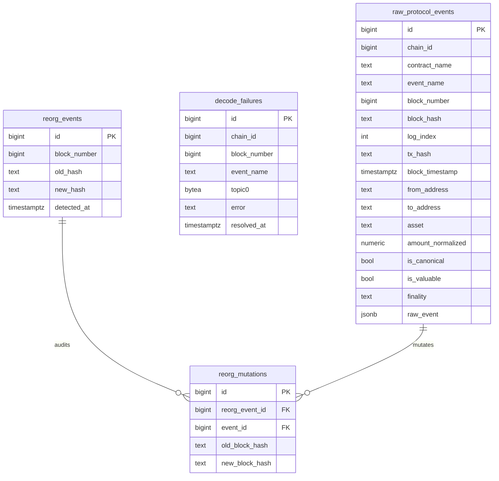

Owned by: `livepeer-indexer`, `livepeer-reorg-watcher`, `livepeer-finality-watcher`.

### Valuations + pricing cache

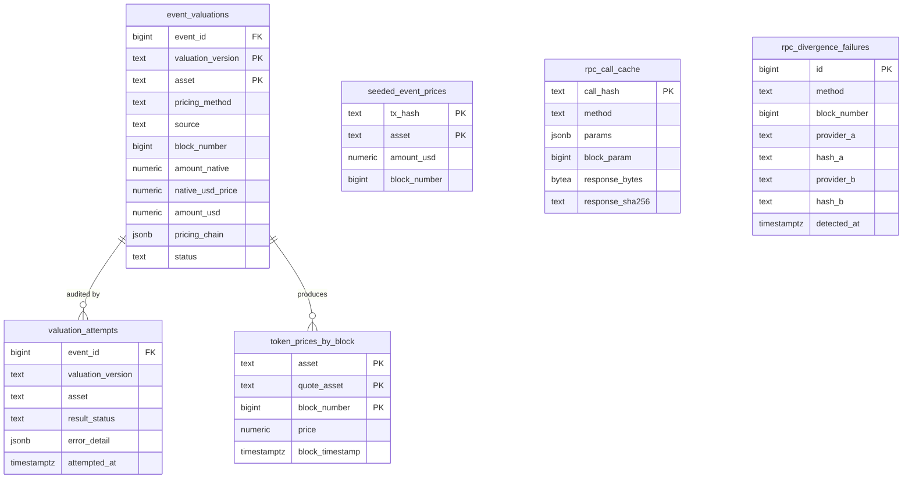

Owned by: `livepeer-valuator`, `livepeer-seed-migrator`. The `rpc_call_cache` is the determinism layer — see [DETERMINISM.md](DETERMINISM.md).

### Derived state — stake + gateway

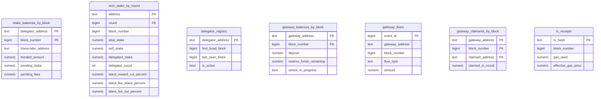

Owned by: `livepeer-staker` (and `tx_receipts` via `tx-receipts-follow`).

### Profiles (materialized views)

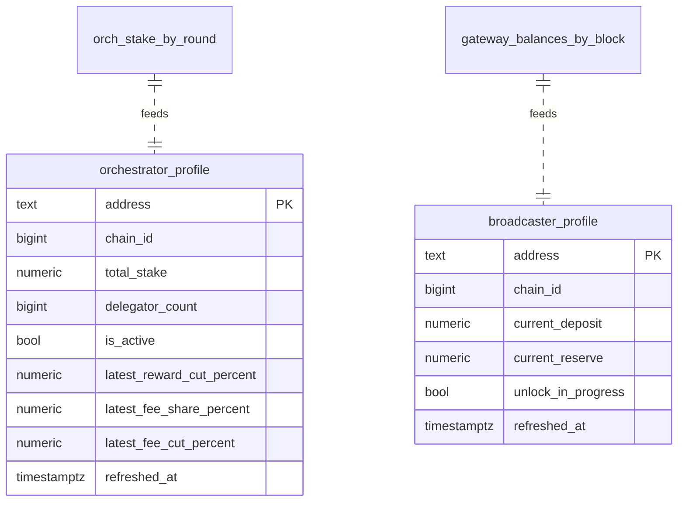

Refreshed `CONCURRENTLY` every 30 s by the daemon (`MATVIEW_REFRESH_INTERVAL_SECS`).

### Rollups

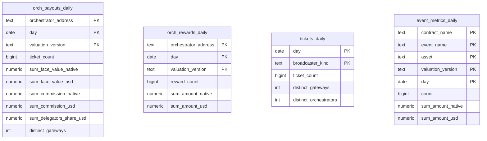

Owned by: `livepeer-rollups`. Each table has its own checkpoint in `indexer_checkpoints` (e.g., `rollup_orch_payouts_daily`).

### Enrichment + operational

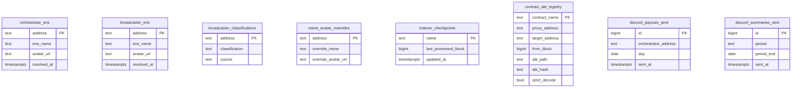

Owned by: `livepeer-enricher` (ENS), `livepeer-indexer` (checkpoints), `livepeer-alert-bot` (discord_*_sent), `livepeer-orchestrator` (contract_abi_registry boot).

> The schema groups above show PK/FK shape only — for canonical column types, constraints, and indexes see the migrations in [`migrations/`](../migrations/) and SPEC §11.

---

## Configuration model

Four cascading layers. None of them depends on the others at build time; the binary just reads what's set.

| Layer | File / source | Committed? | Purpose |
|-------|---------------|------------|---------|
| Static chain config | `config/arbitrum.yaml` | ✓ | Contract addresses, ABI paths, pricing parameters (pool, Chainlink feed, sequencer feed), retry/concurrency policy |
| Env-specific config | `config/env/{dev,staging,prod}.yaml` | ✓ | RPC concurrency, batch sizes, alert toggles per environment |
| Secrets | `.env` | ✗ (gitignored) | `CHAINSTACK_RPC_URL`, `POSTGRES_PASSWORD`, `TELEGRAM_BOT_TOKEN`, `L1_RPC_URL`, etc. Template at `.env.example` |
| Runtime SPA config | `FE_*` env vars on the `livepeer-api` process | ✗ (env) | Surfaced as `GET /config.json` to the browser. See `crates/livepeer-api/src/routes/operational.rs::frontend_config` for the env-var → JSON-key mapping |

The CLI binaries take `--static-config` and `--env-config` paths so a single binary can run dev or prod by pointing at different YAML files. The `.env` is loaded by docker-compose (`env_file: .env`) or sourced by the operator scripts.

---

## Determinism contract

The single most important invariant. Restated tightly:

1. Drop the entire Postgres DB.
2. Replay from a fixture (`tests/fixtures/case-{a,b}/`) consisting of an `rpc_call_cache` CSV dump, the seed SQLite, and a `fixture.env` with `FROM_BLOCK` / `TO_BLOCK`.
3. Hash every output table per SPEC §12.4.
4. The hashes must match `expected_hashes.json` byte-for-byte.

Mechanism: every off-chain read in `livepeer-valuator` (and in any path that uses `livepeer_core::rpc::cross_check`) is mediated by `rpc_call_cache`. Cache miss → primary RPC + secondary RPC cross-check → bytes-equal → store the bytes. Cache hit → return the stored bytes. With the cache pre-populated from the fixture, no network call is made, so output is purely a deterministic function of `(raw_protocol_events ∪ seeded_event_prices ∪ rpc_call_cache)`.

Enforced by the `Determinism` GitHub workflow (manual / on-demand). Full contract in [DETERMINISM.md](DETERMINISM.md).

If you intentionally change the pricing logic, **bump `valuation_version`** and regenerate `expected_hashes.json` via `scripts/compute-determinism-hashes.sh` — never overwrite an existing version's hashes.

---

## Deployment topology

SPEC §15.2 — single host, single Docker network, single Postgres.

```
                 ┌──────────────────────────────────────────────┐
                 │  Single host (Ubuntu)                        │
                 │                                              │
                 │  ┌────────────────────────────────────────┐  │
                 │  │ Docker network: livepeer               │  │
                 │  │                                        │  │
                 │  │ ┌──────────────────┐  ┌──────────────┐ │  │
                 │  │ │ postgres:17      │  │ livepeer-api │ │  │
                 │  │ │ (volume:         │  │ :8080        │ │  │
                 │  │ │  pgdata)         │  └──────────────┘ │  │
                 │  │ └──────────────────┘  ┌──────────────┐ │  │
                 │  │                       │ daemon       │ │  │
                 │  │                       └──────────────┘ │  │
                 │  │                       ┌──────────────┐ │  │
                 │  │                       │ 4× rollups   │ │  │
                 │  │                       └──────────────┘ │  │
                 │  │                       ┌──────────────┐ │  │
                 │  │                       │ staker x3    │ │  │
                 │  │                       └──────────────┘ │  │
                 │  │                       ┌──────────────┐ │  │
                 │  │                       │ enricher     │ │  │
                 │  │                       └──────────────┘ │  │
                 │  │                       ┌──────────────┐ │  │
                 │  │                       │ alert-bot    │ │  │
                 │  │                       └──────────────┘ │  │
                 │  └────────────────────────────────────────┘  │
                 │                                              │
                 │  Cloudflare Tunnel ──► livepeer-api:8080     │
                 └──────────────────────────────────────────────┘
                                       ▲
                                       │
                              ┌────────┴────────┐
                              │ External: Prom  │  (separate host)
                              │ + Grafana       │  (SPEC §15.1)
                              └─────────────────┘
```

All 12 binaries build into one Docker image (`tztcloud/livepeer-protocol-explorer:latest`). The runtime image is slim; each compose service overrides only the `command:` to pick which binary runs. See [DEPLOYMENT.md](DEPLOYMENT.md) for the full prod compose, and [CLOUDFLARE_TUNNEL.md](CLOUDFLARE_TUNNEL.md) for the external-access shape.

---

## CI / workflows

| Workflow | Trigger | Steps | Purpose |
|----------|---------|-------|---------|
| `ci.yml` | push to `main`, every PR | `fmt` / `clippy` / `build` / `test`, all under `RUSTFLAGS="-D warnings"` | Lint + build + unit-test gate. Must be green for any merge. |
| `determinism.yml` | `workflow_dispatch` only | Spin up Postgres 17, run `scripts/run-determinism-replay.sh` per fixture, diff `expected_hashes.json` | Manual enforcement of the SPEC §12.4 replay invariant. Heavy (~15 min); run before any pricing-logic change or fixture update. |

Five integration tests in `livepeer-api` (route tests against a live Postgres) are tagged `#[ignore]` because they require `DATABASE_URL` and a migrated DB. Plain `cargo test --workspace` skips them; run them locally with:

```sh
docker compose up -d postgres
target/release/livepeer-orchestrator migrate-only
cargo test -p livepeer-api -- --ignored
```

---

## Operating modes summary

| Mode | Entry point | When to use |
|------|-------------|-------------|
| **Cold start / bootstrap** | `livepeer-orchestrator bootstrap` | First-time DB setup. Migrates schema, seeds ABI registry, runs full indexer + valuator + staker backfill for the requested range. |
| **Live mode** | `livepeer-daemon follow` | Steady-state operation. Single supervisor process keeps every worker on its cadence. |
| **Live mode (decomposed)** | `scripts/resume-catchup-all.sh` | Same as above but each worker is its own OS process (4× rollups, profile-follow, tx-receipts-follow, gateway loop, enricher follow, daemon follow, api). Easier to introspect / restart individually. |
| **Replay** | `livepeer-orchestrator replay --source-sqlite … --from-block N --to-block M` | Determinism check. Drops state, replays from RPC cache + seed, computes hashes. Used by CI. |
| **One-off subcommands** | `livepeer-orchestrator backfill-cuts`, `livepeer-valuator backfill-lpt-onchain`, … | Ad-hoc maintenance — e.g., recompute a column from chain truth, or re-price one asset class without touching the rest. |

---

## Cross-references

- **[docs/product-specs/v1-livepeer-indexer.md](product-specs/v1-livepeer-indexer.md)** — the canonical encyclopedia. Authoritative for table definitions, valuation algorithms, error semantics.
- **[AGENTS.md](../AGENTS.md)** — the repo map for contributors and agents. Restates the load-bearing invariants.
- **[docs/RUNBOOK.md](RUNBOOK.md)** — operational procedures: restart loops, common troubleshooting, alert escalation.
- **[docs/DEPLOYMENT.md](DEPLOYMENT.md)** — prod compose shape, image pull/push, secret rotation.
- **[docs/DETERMINISM.md](DETERMINISM.md)** — the replay-test contract in full.
- **[docs/POSTGRES_MAINTENANCE.md](POSTGRES_MAINTENANCE.md)** — DB upgrades, vacuum policy, backup/restore.
- **[docs/CLOUDFLARE_TUNNEL.md](CLOUDFLARE_TUNNEL.md)** — public-access tunnel topology.
- **[docs/design-docs/index.md](design-docs/index.md)** — per-decision design records (TOC).
- **[docs/exec-plans/tech-debt-tracker.md](exec-plans/tech-debt-tracker.md)** — known shortcuts + deferred work.
